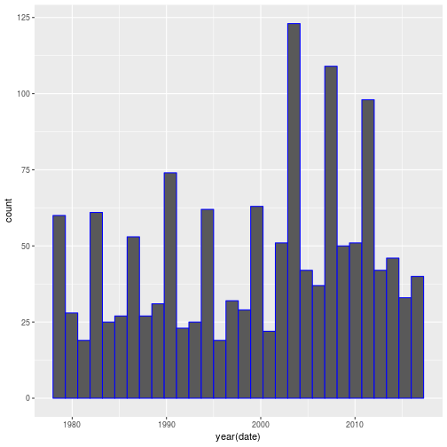

Earthquakes Around The World 1978 - 2016
========================================================
author: Dushan Yovetich
date: 09 April 2017
autosize: true
font-family: 'Times New Roman'
transition: concave

App Description
========================================================
incremental: true

***
Earthquakes are considered ominous, but occur regularly 
around the world. We have created a shiny application 
to show where these natural events have occured. This
application:

- Visualizes eartquakes events
- Provides view of the occurences by year
- Explores where and when they have occured


Data Source
========================================================
- From National Geophysical Data Center's Earthquake Database. 
- Scope: earthquakes >= 5.0 magnitude from 1978 to 2016.
- Data transformations procedures found in GitHub repo. See [Links](#/Links).

```r
# See original dataset dimensions
eq <- read.csv("EarthquakeData.csv", header = TRUE)
dim(eq)
[1] 1402   47
```

High-level Summary of Earthquake Events
========================================================


***
- Great deal of variability between years
- Average magnitude is 6.3272468
- Average number per year is 35.9487179

Links
========================================================

- GitHub Repo: <https://github.com/dushany/DDP_Assignment_Wk4> 

- Shiny App: <https://dushany.shinyapps.io/Earthquakes/>

