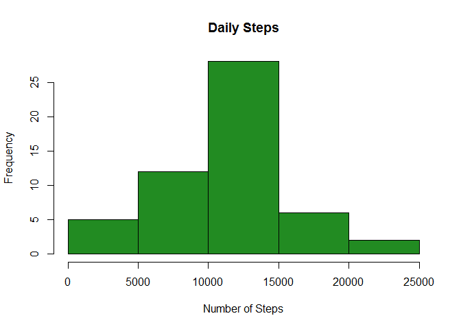
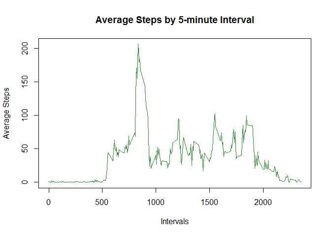
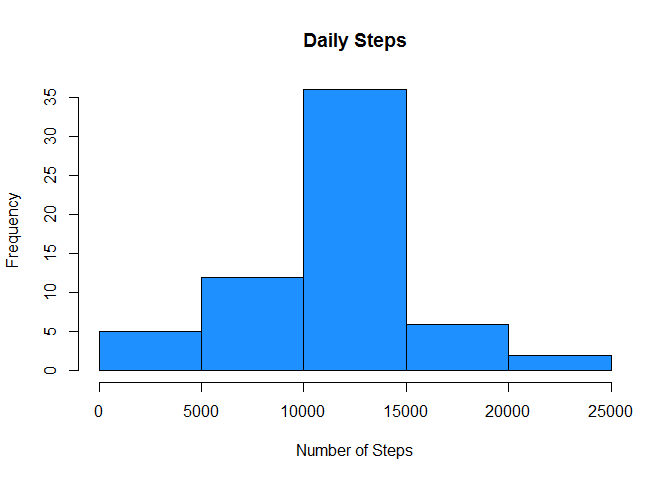
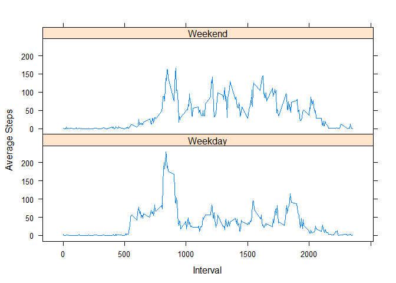

# Reproducible Research: Peer Assessment 1

This assignment makes use of data from a personal activity monitoring device. This device collects data at 5 minute intervals through out the day. The data consists of two months of data from an anonymous individual collected during the months of October and November, 2012 and include the number of steps taken in 5 minute intervals each day.


  
  
## Loading and preprocessing the data

```r
# Load library(s)
library(dplyr)
library(lattice)

# Load data
unzip("activity.zip")
step.data <- read.csv("activity.csv")
step.data$date <- as.Date(step.data$date, format = "%Y-%m-%d")
str(step.data)
```

```
## 'data.frame':	17568 obs. of  3 variables:
##  $ steps   : int  NA NA NA NA NA NA NA NA NA NA ...
##  $ date    : Date, format: "2012-10-01" "2012-10-01" ...
##  $ interval: int  0 5 10 15 20 25 30 35 40 45 ...
```
  
  
## What is mean total number of steps taken per day?  
  
  
1. Plot the total number of steps taken each day.

```r
spd <- step.data %>% group_by(date) %>% summarize(tot.steps = sum(steps))
hist(spd$tot.steps,xlab = "Number of Steps", ylab = "Frequency", main = "Daily Steps", col = "forestgreen")
```

<!-- -->
  
  
2. Calculate the mean and median total number of steps taken per day.

```r
avg <- mean(spd$tot.steps,na.rm = TRUE)
med <- median(spd$tot.steps,na.rm = TRUE)
```

The mean total number of steps taken per day is **10766** and the median is **10765**.  
  
  
## What is the average daily activity pattern?
  
  
1. time-series plot of the 5-minute interval (x-axis) and the average number of steps taken,averaged across all days (y-axis).

```r
api <- step.data %>% group_by(interval) %>% summarize(avg.steps = mean(steps,na.rm = TRUE))
plot(api$interval,api$avg.steps, type = "l", xlab = "Intervals", ylab = "Average Steps", main = "Average Steps by 5-minute Interval", col = "forestgreen")
```

<!-- -->
  
  
2.Calculate which 5-minute interval on average contains the maximum number of steps.

```r
max.step.intvl <- api[which.max(api$avg.steps),]$interval
```

The 5-minute interval with the highest average steps is **835**.
  
  
## Imputing missing values  
  
  
1. Calculate and report the total number of missing values in the dataset.

```r
sum(is.na(step.data$steps))
```

```
## [1] 2304
```
  
  
2. Fill in all of the missing values in the dataset.
3. Create a new dataset that is equal to original dataset but with missing data filled in.

```r
fill.steps <- function(steps,interval) {
  if (is.na(steps)){
    sub.value <- api[api$interval==interval,]$avg.steps
  } else {
    sub.value <- steps
  }
  return(sub.value)
}

rsd <- step.data 
rsd$steps<- with(rsd,mapply(fill.steps,steps,interval))

sum(is.na(rsd$steps))
```

```
## [1] 0
```
  
  
4. Plot total number of steps taken each day and calculate the mean and median total numbers of steps taken per day.

```r
spd2 <- rsd %>% group_by(date) %>% summarize(tot.steps = sum(steps))
hist(spd2$tot.steps,xlab = "Number of Steps", ylab = "Frequency", main = "Daily Steps", col = "dodgerblue")
```

<!-- -->

```r
avg2 <- mean(spd2$tot.steps)
med2 <- median(spd2$tot.steps)
```

The mean total number of steps taken per day is **10766** and the median is **10766**.
  
  
## Are there differences in activity patterns between weekdays and weekends?  
  
  
1. Create a new factor variable in the dataset with two levels - "weekday"
and "weekend" indicating whether a given date is a weekday or weekend
day.

```r
day.flag <- function(date){
  day <- weekdays(date)
  wkday <- c("Monday","Tuesday","Wednesday","Thursday","Friday")
  
  if (day %in% wkday) return("Weekday") else return("Weekend")
  
}

rsd$day <- with(rsd,sapply(date,day.flag))
rsd$day <- as.factor(rsd$day)
summary(rsd)
```

```
##      steps          date               interval         day       
##  Min.   :  0   Min.   :2012-10-01   Min.   :   0   Weekday:12960  
##  1st Qu.:  0   1st Qu.:2012-10-16   1st Qu.: 589   Weekend: 4608  
##  Median :  0   Median :2012-10-31   Median :1178                  
##  Mean   : 37   Mean   :2012-10-31   Mean   :1178                  
##  3rd Qu.: 27   3rd Qu.:2012-11-15   3rd Qu.:1766                  
##  Max.   :806   Max.   :2012-11-30   Max.   :2355
```
  
  
2. Make a panel plot containing a time series plot of the 5-minute interval (x-axis) and the average number of steps taken, averaged across all weekday days or weekend days (y-axis).

```r
rspd <- rsd %>% group_by(day,interval) %>% summarize(avg.steps = mean(steps))
xyplot(avg.steps~interval|day, data = rspd, type = "l", xlab = "Interval", ylab = "Average Steps",
       scales = list(alternating = FALSE), layout = c(1,2))
```

<!-- -->
